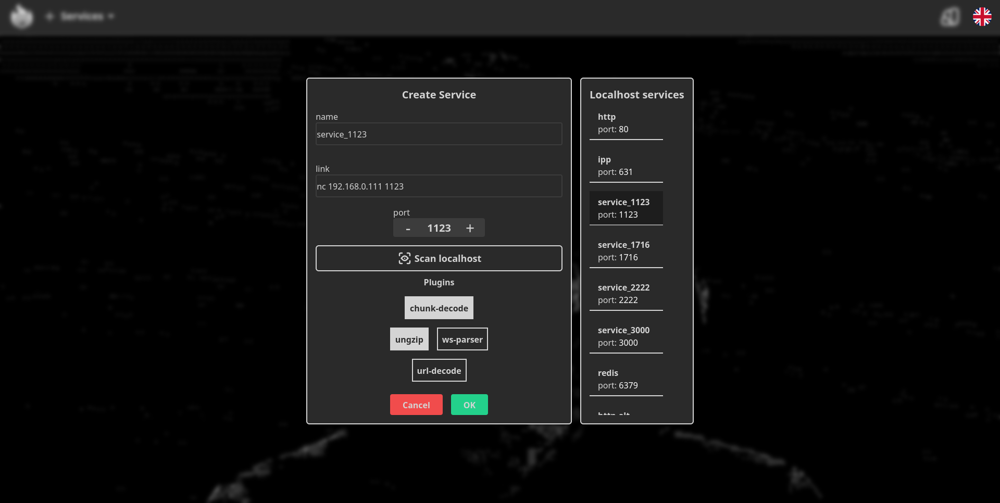
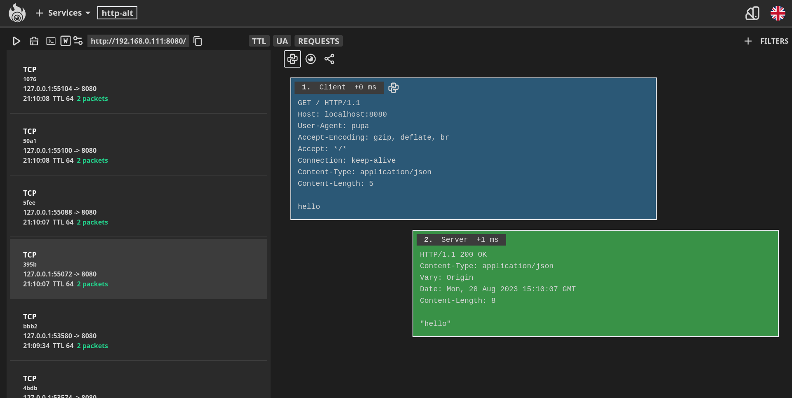
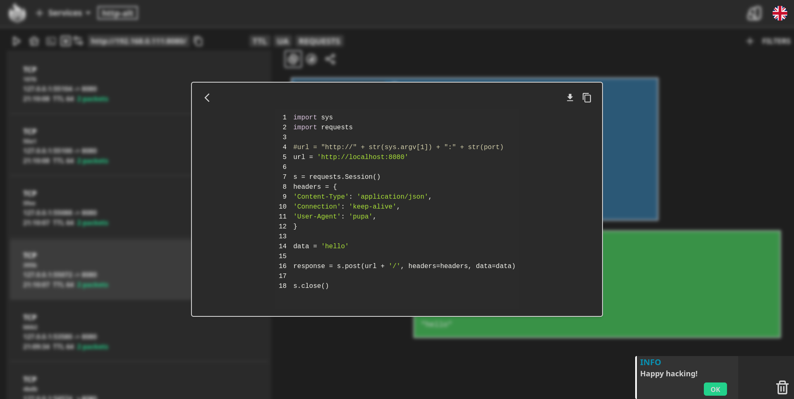
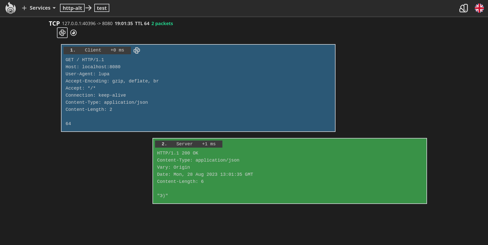

# Altron

>**Altron** - утилита перехвата и анализа трафика для CTF.

Приложение использует брокер сообщений RabbitMQ для распределения пакетов по сервисам вулнбокса и веб-сокеты для передачи клиентской части сеансов взаимодействия с сервисами в режиме реального времени.

## Фичи

- Возможность создание воркспейсов, где можно хранить сеансы и их анализировать.
- Поддержка прослушки tcp/http/udp сервисов
- Конкатенация смежных пакетов
- Возможность прослушивания сервиса внутри воркспейса, где каждые n входящих сеансов сохраняются в БД
- Поддержка плагинов для быстрой обработки пакетов
- Возможность создать воркспейс при создании сервиса, куда нальются сеансы чекеров
- Конвертация сеанса в сплойт на python (pwntools или python requests)
- Возможность просмотра логов сервиса
- Поддержка фильтрации сеансов по паттернам
- Поддержка русского и английского языков
- Отложенное создание воркспейса
- Возможность поделиться сеансами

## Перед запуском

Перед запуском приложения необходимо выполнить следующую команду:

```shell
cp .env.example .env
```

Это файлы с переменными окружения. Необходимо задать значения этим переменным. Заметим, что не все переменные необходимо задать.

## Как запустить

``` shell
chmod +x ./start.sh
sudo ./start.sh
```

## Конфигурационные переменные

Из конфигурационных переменных в файле .env перечислим все те переменные, которые скорее всего необходимо будет настроить.

- INTERFACE_NAME сетевой интерфейс, через который поступают пакеты на локалхост
- UDP_STREAM_TIMEOUT таймаут сеанса по UDP. По умолчанию выставлено значение 40 секунд, значения задаётся строго через добавление символа s (секунды)
- TCP_STREAM_TIMEOUT таймаут сеанса по TCP. На каждый созданный сеанс запускается таймер, по истечению которого сеанс отправится клиенту. Сеанс отправляется либо по получению пакетов FIN-ACK-FIN-ACK-ACK, либо по истечению таймера.
- PASSWORD пароль для входа в систему
- Список портов сервисов. Настроить на тот случай, если порты по умолчанию заняты
- ALTRON_HOST ip альтрона в локальной сети. Используется в сервисе сеансов, когда необходимо создать воркспейс с готовыми сеансами из очереди, метод выкачивает сеансы и отправляет и затем обращается к ядру приложения, которое эти сеансы сохраняет в БД
- PORT порт на котором будет запущено приложение (клиентская часть)

## Плагины

Плагины создаются на языке Golang. Плагин выглядит следующим образом:

```golang
package main

import "fmt"

var Main Plugin

type Plugin struct {
}

func (p *Plugin) Process(sessionPayload [][]byte) ([][]byte, error) {
    // обработка сессии
    return sessionPayload, nil
}
```

Альтрон при запуске проверяет плагины и в каждом из них ищет переменную с названием Main. Если объект найден, происходит проверка класса Plugin (можете дать любое другое название) на реализацию интерфейса с единственным методом ```Process(sessionPayload [][]byte) ([][]byte, error)```, где на вход подаётся список пакетов, а возвращается обработанная сессия. После этого идет проверка файла plugins_order.txt - там указывается приоритет использования плагинов.

Таким образом, чтобы создать плагин нужно создать сначала папку названием плагина, затем файл .go с названием плагина внутри нашей папки, а после этого сделать реализацию интерфейса с методом Process и занести название плагина в список plugins_order.

## Скриншоты






